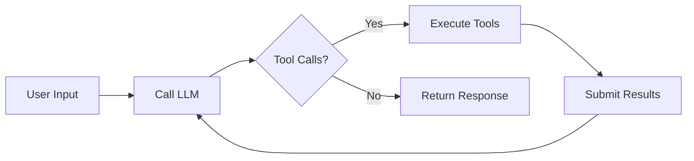
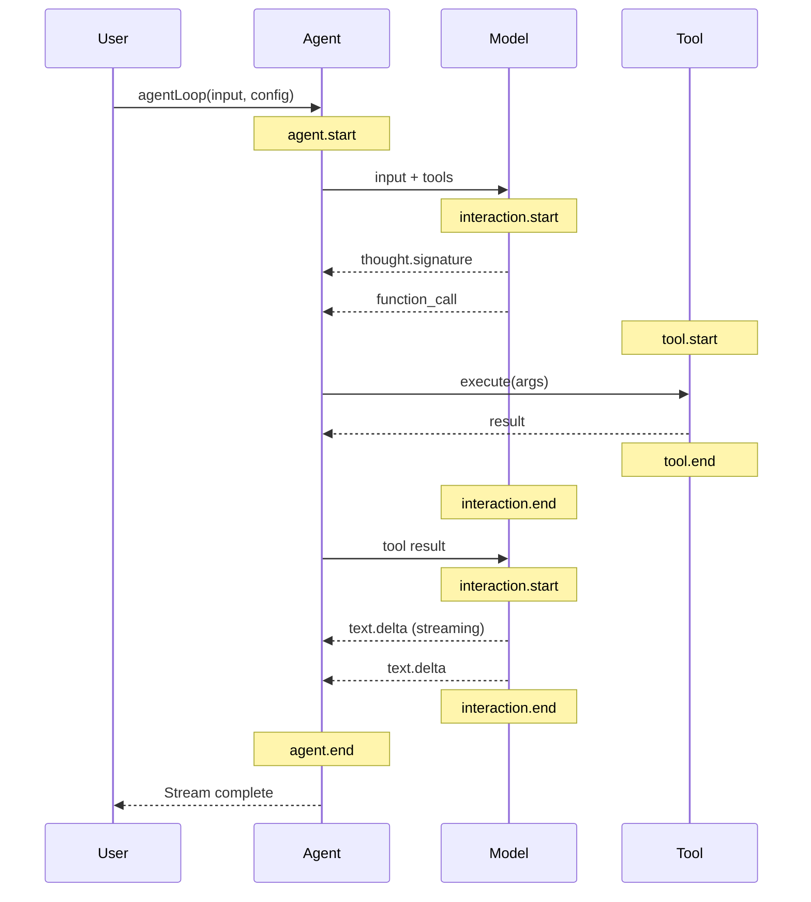

import Tip from '../../../components/callouts/Tip.astro';

The **agent loop** is the core execution cycle that powers AI agents. It's a simple but powerful pattern: call the model, execute any requested tools, send results back, repeat.

## The Loop Pattern

An agent is not about a single LLM call. It's about the **loop**:



The loop continues until the model produces a response without tool calls — indicating it has completed the task or needs more input from the user.

---

## Event Flow

The `agentLoop` function emits events throughout execution:



---

## Usage

### Basic Execution

```typescript
import { agentLoop } from '@philschmid/agents-core';

const stream = agentLoop(
  [{ type: 'text', text: 'What is 25 * 17?' }],
  {
    model: 'gemini-3-flash-preview',
    tools: [calculateTool],
  }
);

for await (const event of stream) {
  console.log(event.type, event);
}
```

### Configuration Options

| Option | Type | Description |
|--------|------|-------------|
| `model` | `string` | Model ID (e.g., `'gemini-3-flash-preview'`) |
| `tools` | `AgentTool[]` | Available tools |
| `systemInstruction` | `string` | System prompt |
| `previousInteractionId` | `string` | Resume from previous interaction |
| `transformContext` | `function` | Modify context before each LLM call |

---

## Interaction Lifecycle

Each iteration of the loop is an **interaction** — a single LLM call that may produce text, tool calls, or both.

### Interaction States

1. **Start**: Request sent to Gemini API
2. **Streaming**: Receiving `text.delta` events
3. **Tool Calls**: Model requests function execution
4. **End**: Response complete

<Tip>
The Interactions API maintains state server-side. You don't need to resend the full conversation history — just pass `previous_interaction_id`.
</Tip>

---

## Tool Execution

When the model returns a `function_call`, the agent loop:

1. Looks up the tool by name
2. Calls `tool.execute(id, args, signal, onUpdate)`
3. Captures the result (or error)
4. Submits the result back to the model

```typescript
const calculateTool: AgentTool = {
  name: 'calculate',
  label: 'Calculate',
  description: 'Perform math calculations',
  parameters: {
    type: 'object',
    properties: {
      expression: { type: 'string' }
    },
    required: ['expression']
  },
  execute: async (_id, args) => {
    const result = eval(args.expression as string);
    return { result: String(result) };
  }
};
```

---

## Stream Consumption

The agent loop returns an `AsyncGenerator` that yields events:

```typescript
const stream = agentLoop(input, config);

// Collect all events
const events: AgentEvent[] = [];
for await (const event of stream) {
  events.push(event);
}

// Get final result
const lastEvent = events.at(-1);
if (lastEvent?.type === 'agent.end') {
  console.log('Turns:', lastEvent.interactions.length);
}
```

### Helper: printStream

For quick prototyping, use the built-in printer:

```typescript
import { printStream } from '@philschmid/agents-core';

const result = await printStream(stream, { verbosity: 'verbose' });
```

---

## Error Handling

Tool errors are captured and returned to the model:

```typescript
execute: async (_id, args) => {
  try {
    const data = await fetchData(args.url);
    return { result: JSON.stringify(data) };
  } catch (error) {
    return { 
      result: `Error: ${error.message}`, 
      isError: true 
    };
  }
}
```

The model can then decide how to proceed — retry, use a different tool, or report the error to the user.

---

## Next Steps

- [Defining Tools](/concepts/tools/): Tool interface and best practices
- [Hooks System](/concepts/hooks/): Intercept the loop at each stage
- [Streaming Guide](/guides/streaming/): Handle events in your UI
