Hooks let you intercept agent lifecycle events — block tool calls, modify context, log actions, or inject follow-up inputs.

```typescript
import { createAgentSession } from '@philschmid/agent';

const session = createAgentSession({
  model: 'gemini-3-flash-preview',
  tools: ['read', 'write', 'bash'],
});

// Block destructive commands
session.on('beforeToolExecute', (event) => {
  if (event.toolName === 'bash' && event.arguments.command?.includes('rm -rf')) {
    return { allow: false, reason: 'Destructive command blocked' };
  }
  return { allow: true };
});
```

---

## What Are Hooks?

Hooks are callbacks that fire at specific points in the agent lifecycle. They let you:

- **Observe**: Log tool calls, track usage, collect metrics
- **Modify**: Change system instructions, filter context, transform results
- **Control**: Block dangerous operations, require approval, rate limit

Hooks run synchronously in registration order. Each hook type has specific rules for how multiple handlers interact (see [The emit() Method](#the-emit-method)).

---

## Architecture

The hooks system exists only in `@philschmid/agent` — the core package (`@philschmid/agents-core`) provides a raw agent loop with no interception points.


| Package | Provides | Hooks Support |
|---------|----------|---------------|
| `@philschmid/agents-core` | `agentLoop`, `tool()` factory | ❌ None |
| `@philschmid/agent` | `AgentSession`, `HookRunner`, built-in tools | ✅ Full hooks system |

**Why this separation?** The core package stays minimal and unopinionated. If you need custom lifecycle handling, you can build your own wrapper around `agentLoop`. The `agent` package provides one implementation via `HookRunner`.

---

## Hook Lifecycle

```mermaid
flowchart TB
    A["🟢 onAgentStart"] --> B["🔵 onInteractionStart"]
    B --> C{Tool Call?}
    C -->|Yes| D["🟡 beforeToolExecute"]
    D -->|Allowed| E[Execute Tool]
    D -->|Blocked| F[Return Blocked]
    E --> G["🟠 afterToolExecute"]
    F --> H["⚪ onInteractionEnd"]
    G --> H
    C -->|No| H
    H --> I{More turns?}
    I -->|Yes| B
    I -->|No| J["🔴 onAgentEnd"]
    J -->|Inject input| B
    J -->|Done| K[Complete]

    style A fill:#4ade80,color:#000
    style B fill:#60a5fa,color:#000
    style D fill:#fbbf24,color:#000
    style G fill:#fb923c,color:#000
    style H fill:#e5e7eb,color:#000
    style J fill:#f87171,color:#000
```



---

## Hook Types

Each hook receives an event object and returns a result. Here are the TypeScript types for all hooks:

### onAgentStart

Fires once before the first LLM call. Modify tools, system instruction, or initial input.

```typescript
// Event
type OnAgentStartEvent = {
  type: 'onAgentStart';
  tools: AgentTool[];
  systemInstruction?: string;
  input: Turn['content'];
};

// Result
type OnAgentStartResult = {
  tools?: AgentTool[];
  systemInstruction?: string;
  input?: Turn['content'];
};
```

```typescript
session.on('onAgentStart', (event: OnAgentStartEvent): OnAgentStartResult => {
  return {
    systemInstruction: event.systemInstruction + `\nCurrent time: ${new Date()}`,
  };
});
```

---

### onInteractionStart

Fires before each LLM call. Filter or transform the interaction history.

```typescript
// Event
type OnInteractionStartEvent = {
  type: 'onInteractionStart';
  interactions: Turn[];
};

// Result
type OnInteractionStartResult = {
  interactions?: Turn[];
};
```

```typescript
session.on('onInteractionStart', (event: OnInteractionStartEvent): OnInteractionStartResult => {
  // Keep only last 10 interactions (sliding window)
  return { interactions: event.interactions.slice(-10) };
});
```

---

### beforeToolExecute

Fires before each tool call. Block execution or modify arguments.

```typescript
// Event
type BeforeToolExecuteEvent = {
  type: 'beforeToolExecute';
  toolName: string;
  toolCallId: string;
  arguments: Record<string, unknown>;
};

// Result (required)
type BeforeToolExecuteResult = {
  allow: boolean;
  reason?: string;           // Why blocked (if allow: false)
  arguments?: Record<string, unknown>;  // Modified args
};
```

```typescript
session.on('beforeToolExecute', (event: BeforeToolExecuteEvent): BeforeToolExecuteResult => {
  if (event.toolName === 'bash') {
    const cmd = event.arguments.command as string;
    if (cmd.includes('rm -rf')) {
      return { allow: false, reason: 'Destructive command blocked' };
    }
  }
  return { allow: true };
});
```

---

### afterToolExecute

Fires after each tool call. Modify the result before sending to the model.

```typescript
// Event
type AfterToolExecuteEvent = {
  type: 'afterToolExecute';
  toolName: string;
  toolCallId: string;
  result: AgentToolResult;
};

// Result
type AfterToolExecuteResult = {
  result?: AgentToolResult;
};
```

```typescript
session.on('afterToolExecute', (event: AfterToolExecuteEvent): AfterToolExecuteResult => {
  if (event.result.result.length > 10000) {
    return {
      result: { result: event.result.result.slice(0, 10000) + '\n...(truncated)' },
    };
  }
  return {};
});
```

---

### onInteractionEnd

Fires after each LLM call completes. Observe only — no modifications.

```typescript
// Event
type OnInteractionEndEvent = {
  type: 'onInteractionEnd';
  turn: Turn;
};

// Result
type OnInteractionEndResult = undefined;  // No return value
```

```typescript
session.on('onInteractionEnd', (event: OnInteractionEndEvent): void => {
  console.log(`Turn complete: ${event.turn.role}`);
});
```

---

### onAgentEnd

Fires when agent loop completes. Inject follow-up input to continue.

```typescript
// Event
type OnAgentEndEvent = {
  type: 'onAgentEnd';
  interactionCount: number;
  filesModified?: number;
};

// Result
type OnAgentEndResult = {
  input?: string;  // Inject to trigger another loop
};
```

```typescript
session.on('onAgentEnd', (event: OnAgentEndEvent): OnAgentEndResult => {
  if (event.interactionCount < 3) {
    return { input: 'Please continue with the next step.' };
  }
  return {}; // Complete normally
});
```

---

## How HookRunner Works

The `HookRunner` class manages hook registration and execution. Understanding its internals helps when building custom extensions.

### Handler Storage

```typescript
class HookRunner {
  private handlers = new Map<HookName, Handler[]>();
  
  on(hookName, handler) {
    // Handlers stored in registration order
    this.handlers.get(hookName)?.push(handler);
  }
}
```

### The emit() Method

When `emit(hookName, event)` is called, handlers run in registration order. Result merging varies by hook type:

| Hook | Merging Strategy |
|------|------------------|
| `beforeToolExecute` | **First block wins**. Arguments merge until a handler returns `{ allow: false }` |
| `onAgentEnd` | **Combine inputs**. All `input` values joined with `\n\n` |
| `onInteractionEnd` | **Observe only**. Returns `undefined`, handlers just observe |
| Others | **Last write wins**. Results shallow-merged, later handlers override |

```typescript
// beforeToolExecute: First block wins
session.on('beforeToolExecute', () => ({ allow: true }));
session.on('beforeToolExecute', () => ({ allow: false, reason: 'Blocked' }));
session.on('beforeToolExecute', () => ({ allow: true })); // Never runs
// Result: Blocked

// onAgentEnd: Inputs combined
session.on('onAgentEnd', () => ({ input: 'Verify changes' }));
session.on('onAgentEnd', () => ({ input: 'Check for errors' }));
// Result: input = 'Verify changes\n\nCheck for errors'

// onAgentStart: Last write wins
session.on('onAgentStart', () => ({ systemInstruction: 'First' }));
session.on('onAgentStart', () => ({ systemInstruction: 'Second' }));
// Result: systemInstruction = 'Second'
```

---

## Building Your Own Hooks

### Using HookRunner Directly

You can use `HookRunner` independently of `AgentSession`:

```typescript
import { HookRunner } from '@philschmid/agent';

const hooks = new HookRunner();

hooks.on('beforeToolExecute', (event) => {
  console.log(`Tool: ${event.toolName}`);
  return { allow: true };
});

// Emit manually
const result = await hooks.emit('beforeToolExecute', {
  type: 'beforeToolExecute',
  toolName: 'bash',
  toolCallId: 'call-123',
  arguments: { command: 'ls -la' },
});

console.log(result.allow); // true
```

### Extending AgentSession

For custom lifecycle behavior, extend `AgentSession`:

```typescript
import { AgentSession, type AgentSessionOptions } from '@philschmid/agent';

class MyAgentSession extends AgentSession {
  constructor(options: AgentSessionOptions) {
    super(options);
    
    // Register default hooks
    this.on('beforeToolExecute', this.auditLog.bind(this));
    this.on('onAgentEnd', this.summarize.bind(this));
  }
  
  private auditLog(event) {
    console.log(`[AUDIT] ${event.toolName}(${JSON.stringify(event.arguments)})`);
    return { allow: true };
  }
  
  private summarize(event) {
    if (event.interactionCount > 5) {
      return { input: 'Provide a summary of what you accomplished.' };
    }
    return {};
  }
}
```

### Building on agents-core Directly

For full control, wrap `agentLoop` yourself:

```typescript
import { agentLoop } from '@philschmid/agents-core';

async function myCustomLoop(input, options) {
  // Pre-processing hook point
  const modifiedInput = await myBeforeHook(input);
  
  const stream = agentLoop(modifiedInput, options);
  
  for await (const event of stream) {
    // Event interception hook point
    if (event.type === 'tool.start') {
      const allowed = await myToolApproval(event);
      if (!allowed) continue;
    }
    yield event;
  }
  
  // Post-processing hook point
  await myAfterHook();
}
```

---

## Hook Reference

| Hook | When | Can Modify | Returns |
|------|------|------------|---------|
| `onAgentStart` | Once, before first LLM call | `tools`, `systemInstruction`, `input` | Modified values |
| `onInteractionStart` | Before each LLM call | `interactions` | Filtered interactions |
| `beforeToolExecute` | Before each tool runs | `arguments` | `{ allow, reason?, arguments? }` |
| `afterToolExecute` | After each tool completes | `result` | `{ result? }` |
| `onInteractionEnd` | After each LLM turn | — (observe only) | `undefined` |
| `onAgentEnd` | When agent loop completes | — | `{ input? }` to continue |

---

## Practical Examples

### Command Approval

```typescript
const ALLOWED_COMMANDS = ['ls', 'pwd', 'cat', 'head', 'tail'];

session.on('beforeToolExecute', (event) => {
  if (event.toolName !== 'bash') return { allow: true };

  const cmd = event.arguments.command as string;
  const firstWord = cmd.split(' ')[0];

  if (!ALLOWED_COMMANDS.includes(firstWord)) {
    return { allow: false, reason: `Command '${firstWord}' not in allowlist` };
  }
  return { allow: true };
});
```

### Rate Limiting

```typescript
const callCounts = new Map<string, number>();

session.on('beforeToolExecute', (event) => {
  const count = callCounts.get(event.toolName) || 0;
  
  if (count >= 10) {
    return { allow: false, reason: `Tool ${event.toolName} rate limited` };
  }

  callCounts.set(event.toolName, count + 1);
  return { allow: true };
});
```

### Logging

```typescript
session.on('beforeToolExecute', (event) => {
  console.log(`[TOOL] ${event.toolName}(${JSON.stringify(event.arguments)})`);
  return { allow: true };
});

session.on('afterToolExecute', (event) => {
  const preview = event.result.result.slice(0, 100);
  console.log(`[RESULT] ${preview}${event.result.result.length > 100 ? '...' : ''}`);
  return {};
});
```

---

## Next Steps

- [Tools](/concepts/tools/): How tools work
- [Configuration](/configuration/): Configure default tools and settings
- [Examples](/examples/): See hooks in action
